# Groundwater Quality Intelligence — WAWQI Analytics Platform

> **An End-to-End Data Analytics, Statistical Modeling & Decision Support Platform for Groundwater Quality Monitoring in India**

---

### 💡 RECRUITER HIGHLIGHTS
#### What this project demonstrates:
- **End-to-End Data Analytics Pipeline:** Data ingestion, profiling, cleaning, normalization, modeling, and interactive reporting.
- **Large-Scale Data Cleaning & Normalization:** Ingested and reconciled 30 heterogeneous CGWB datasets containing 1,609,277 observations across 165,162 water samples.
- **SQL-Based Analytical Modeling:** Custom EAV PostgreSQL schema, analytical views, and materialized views designed for scalable data analysis.
- **Statistical & Percentile Analysis:** Percentile distribution analysis (Min, Median, P75, P95, P99) tailored for right-skewed environmental WQI distributions.
- **Data Quality & Provenance Management:** Preserved raw values, flagged source-level anomalies, and segregated missing parameter coverage from true 0 values.
- **Geographic & Spatial Analytics:** Interactive state-, district-, and station-level GIS mapping of compliance metrics across 165,010 location records.
- **KPI & Metric Design:** Scientific Weighted Arithmetic Water Quality Index (WAWQI) formula implementation adhering to BIS IS 10500:2012 standards.
- **REST API-Based Analytics Delivery:** Node.js/Express RESTful backend serving normalized analytical datasets to a React single-page application.
- **Business-Style Interactive Dashboarding:** Executive-level KPI cards, binned distribution charts, dynamic state comparisons, and station risk profiling.

---

## 📊 AT A GLANCE

- **30** Source CGWB State/UT CSV Datasets
- **165,162** Immutably Stored Water Samples
- **1,609,277** Chemical Parameter Observations
- **120,738** WAWQI-Eligible Samples ($\ge 6$ Core Parameters)
- **44,424** WAWQI-Unavailable Samples (Flagged Insufficient Coverage)
- **22,753** Canonical Monitoring Station Identities
- **165,010** Valid GIS Location Records
- **152** Invalid/Missing Coordinate Records (Isolated & Flagged)

---

## Platform Preview

<p align="center">
  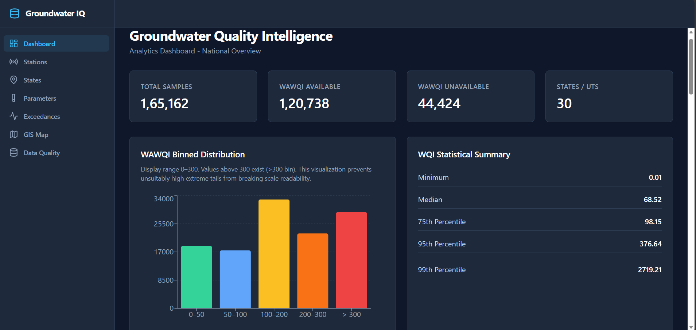
</p>

*Interactive Groundwater Quality Analytics Dashboard*

---

## 1. PROJECT OVERVIEW

Groundwater-quality data collected by the Central Ground Water Board (CGWB) across Indian States and Union Territories (UTs) is inherently complex and fragmented. Raw datasets feature inconsistent schemas, non-standard parameter naming, variable measurement units, missing coordinates, and parameter sparsity.

**Groundwater Quality Intelligence** addresses this challenge by implementing an end-to-end data analytics workflow that transforms raw, heterogeneous environmental datasets into a validated analytical data model and interactive decision-support dashboard:

```text
Raw Environmental Datasets (30 CSVs)
        │
        ▼
Data Profiling & Quality Assessment
        │
        ▼
ETL & Schema Normalization
        │
        ▼
PostgreSQL Analytical Data Model (EAV)
        │
        ▼
WAWQI Computation & Statistical Modeling
        │
        ▼
Geographic & Station Intelligence
        │
        ▼
Interactive Analytics Dashboard & Decision Support
```

---

## 2. WHY THIS PROJECT MATTERS (ANALYTICAL & BUSINESS CONTEXT)

Assessing environmental water safety across a nation as diverse as India presents significant analytical challenges:
- **Fragmented Environmental Datasets:** Sampling protocols and reported chemical parameters vary across states and historical monitoring years.
- **Inconsistent Parameter Schemas:** Raw datasets use different column headers, units (e.g., mg/L vs. ppm), and parameter combinations.
- **Data-Quality & Missing-Value Challenges:** Naive data processing often silently replaces missing values with zeros or discards incomplete records, distorting statistical aggregates.
- **Geographic Variability:** Chemical concentration baselines differ significantly across regional aquifers, making raw concentration comparisons difficult across state boundaries.
- **Need for Reproducible Metrics & Decision Support:** Decision-makers require reproducible, standardized indices (such as WAWQI) and interactive visual tools to identify regional contamination patterns, compare district risk levels, examine station history, and prioritize field investigations.

---

## 3. END-TO-END DATA ANALYTICS WORKFLOW

### A. Data Ingestion & Profiling
- Ingested 30 state-level CGWB groundwater CSV files.
- Profiled schemas, parameter coverage, missing values, coordinate validity ($6.0^\circ \le \text{lat} \le 37.5^\circ$, $68.0^\circ \le \text{lon} \le 97.5^\circ$), date formatting, and numerical outliers.

### B. Data Transformation & Quality Assurance
- **Immutability & Provenance:** Raw sample records and parameter values are preserved in staging tables (`water_samples`, `sample_parameter_values`) with full lineage back to the originating CSV dataset (`source_datasets`).
- **No Silent Zero-Filling:** Missing chemical measurements are preserved as `NULL` to prevent artificial bias in concentration averages or WQI ratings.
- **Source Anomaly Retainage:** Extreme source-level concentrations (such as Uranium at 450 mg/L in Sample 1419) are retained raw per ETL rules and annotated in `data_quality_flags` rather than being silently truncated or deleted.
- **Spatial Scrubbing:** 152 samples with invalid/missing coordinates were flagged and excluded from spatial mapping without discarding their water-chemistry data.

### C. Analytical Database Modeling (PostgreSQL EAV Architecture)
To accommodate parameter sparsity across historical sampling years (where one state dataset may measure 12 parameters while another measures 25), the database implements an **Entity-Attribute-Value (EAV)** schema:
- `water_samples` (Entity): Primary sample metadata (date, state, district, location_id).
- `parameters` (Attribute): Canonical chemical definitions and BIS standards.
- `sample_parameter_values` (Value): Long-format individual parameter observations (1,609,277 rows).
- `wawqi_results` (Computed Analytical Layer): Calculated WAWQI values, quality categories, sub-index JSON breakdown, and dominant parameter assignments.

---

## 4. KEY ANALYTICS PERFORMED

### A. Weighted Arithmetic Water Quality Index (WAWQI) Analysis
The platform computes a standardized WAWQI based on Bureau of Indian Standards (BIS IS 10500:2012) drinking water specifications:
- **7 Core Parameters:** pH, Chloride ($\text{Cl}$), Sulphate ($\text{SO}_4$), Total Hardness, Calcium ($\text{Ca}$), Magnesium ($\text{Mg}$), Iron ($\text{Fe}$).
- **2 Conditional Heavy-Metal Parameters:** Arsenic ($\text{As}$), Uranium ($\text{U}$).
- **Eligibility Threshold:** Requires a minimum of **6 valid core parameters**. Samples meeting this threshold (120,738) are scored; incomplete samples (44,424) are categorized as `WAWQI UNAVAILABLE`.
- **Dynamic Weighting:** Unit weights ($w_i$) are calculated dynamically based on parameter specific standards ($S_i$), ensuring parameter sub-indices ($q_i$) correctly reflect toxicity severity.

### B. Statistical & Percentile Analysis
Because environmental WQI distributions exhibit extreme right-skewness due to localized contamination spikes, relying solely on arithmetic means provides a misleading picture of water quality. The platform calculates complete dataset percentiles:
- **Minimum:** `0.01`
- **Median (P50):** `68.52`
- **75th Percentile (P75):** `98.15`
- **95th Percentile (P95):** `376.64`
- **99th Percentile (P99):** `2,719.21`

*Analytical Value:* Percentile distribution metrics clearly distinguish the bulk of safe/moderate samples from long-tailed extreme values, enabling realistic environmental risk assessment.

### C. Geographic & Risk Analysis
- Aggregates WAWQI metrics at state, district, and monitoring-station levels.
- Bins WAWQI scores into 5 standardized categories:
  - **Excellent (0–25):** `18,821` samples (15.59%)
  - **Good (26–50):** `17,465` samples (14.47%)
  - **Poor (51–75):** `32,834` samples (27.19%)
  - **Very Poor (76–100):** `22,587` samples (18.71%)
  - **Unsuitable (> 100):** `29,031` samples (24.04%)

### D. Station Intelligence & Dominant Contaminant Analysis
- Groups physical sampling locations into **22,753 canonical station identities**.
- Categorizes station data richness into `DATA RICH` ($\ge 5$ parameters) and `DATA LIMITED` ($< 5$ parameters).
- Identifies the **historically dominant parameter** for each sample and station based on maximum sub-index contribution ($\max(w_i \cdot q_i)$).

---

## 5. KEY ANALYTICAL FINDINGS

1. **Skewed Quality Distribution:** 57.25% of eligible samples fall into Excellent, Good, or Poor categories (WQI $\le 75$), while 24.04% (29,031 samples) exceed the Unsuitable threshold (WQI $> 100$).
2. **Right-Tailed Extremes:** Median WQI is 68.52 (within Poor category), whereas the 95th percentile is 376.64 and 99th percentile reaches 2,719.21. Large WAWQI values are mathematically driven by high recorded concentrations of toxic elements (e.g., Uranium, Arsenic) relative to strict BIS health limits.
3. **Parameter Availability Sparsity:** Out of 165,162 total water samples, 73.1% (120,738) possess sufficient core parameter coverage for WAWQI scoring, highlighting historical sampling variance across monitoring agencies.
4. **Dominant Contaminants:** Fluoride, Nitrates, Total Dissolved Solids (TDS), and localized Heavy Metals emerge as the primary parameters driving elevated WQI sub-indices across vulnerable districts.

---

## 6. BUSINESS & ANALYTICAL VALUE

- **Environmental Monitoring:** Quickly isolate high-risk districts and stations requiring immediate water quality intervention.
- **Regional Benchmarking:** Compare water quality across states and districts using a standardized, reproducible scientific metric.
- **Data Integrity Transparency:** Distinguish between unmonitored parameters (`WAWQI UNAVAILABLE`) and true safe readings, avoiding false positives.
- **Station-Level Deep Dives:** Transition seamlessly from macro state-level KPIs down to specific monitoring stations and historical trends.
- **Decision Support:** Provides structured analytical evidence to guide water resource planning, sampling frequency allocation, and remediation efforts.

---

## Platform Screenshots

### 1. Dashboard Overview

**National WAWQI Analytics Dashboard**

Provides the national analytical overview, WAWQI availability, distribution analysis, and statistical summary across the groundwater dataset.


### 2. Data Quality Intelligence

Separates unavailable WAWQI results, invalid coordinates, and source-level data-quality issues from valid analytical outcomes without treating missing values as zero.

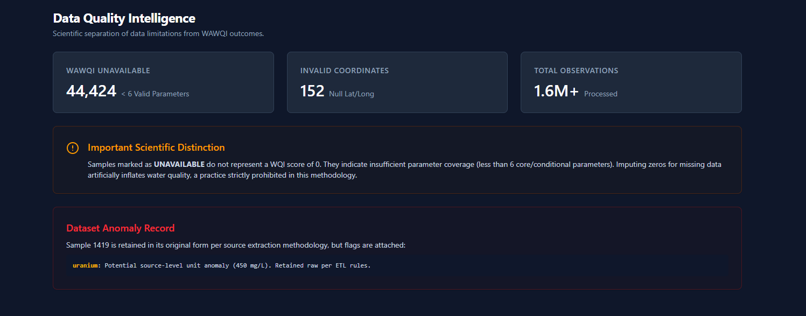

### 3. GIS Data — List View

Provides a tabular view of spatial groundwater-quality records with station, location, WAWQI, category, and coordinate information.

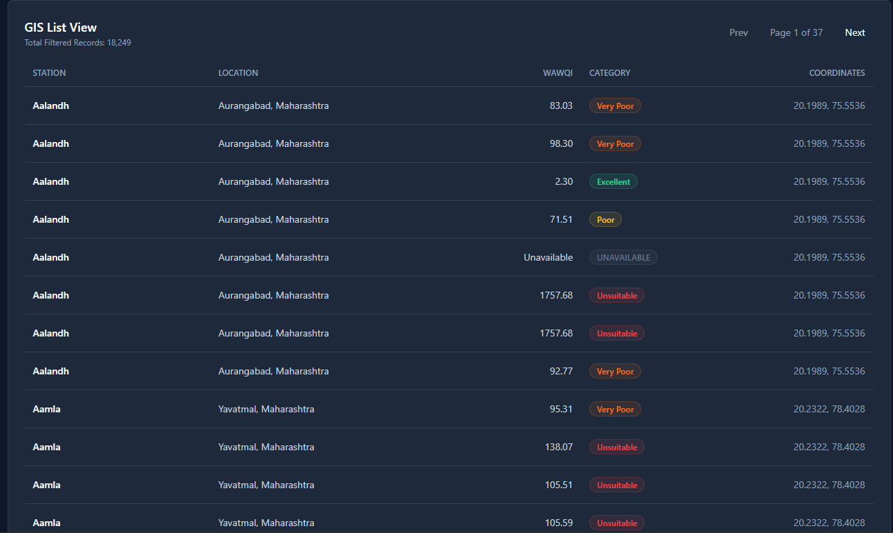

### 4. GIS Intelligence

Enables geographic exploration of WAWQI categories with state, district, and category filtering and paginated spatial data for browser performance.

The complete GIS dataset is accessible through server-side pagination and filtering, with a maximum of 500 points rendered per page.

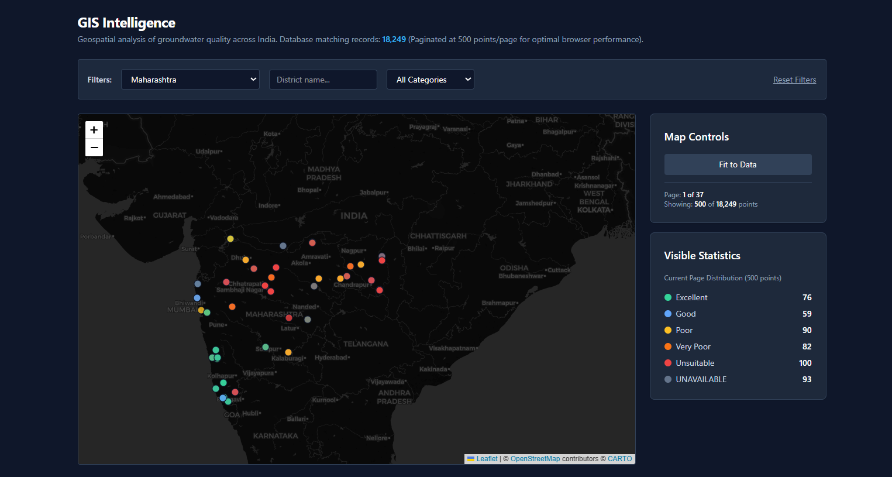

### 5. Parameter Exceedance Analysis

Compares valid parameter observations against the implemented BIS reference limits and summarizes exceedance counts and percentages.

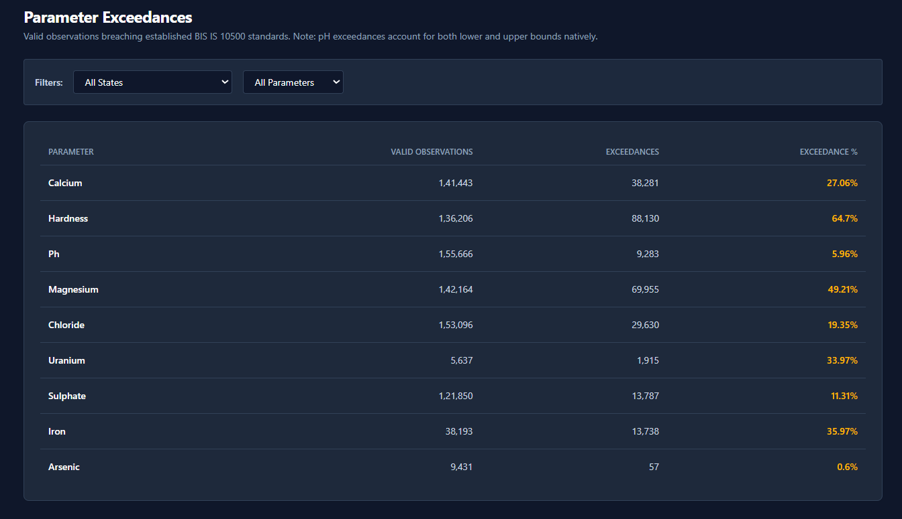

### 6. Parameter Analytics

Provides the canonical WAWQI parameter set, units, reference standards, and analytical limit types used by the platform.

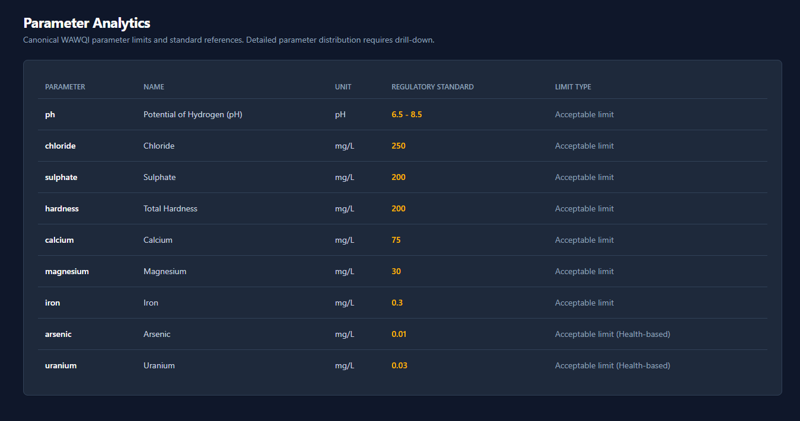

### 7. State-Level Overview

Enables state-level comparison of sample volume, WAWQI eligibility, and median WAWQI across the 30-state/UT dataset.

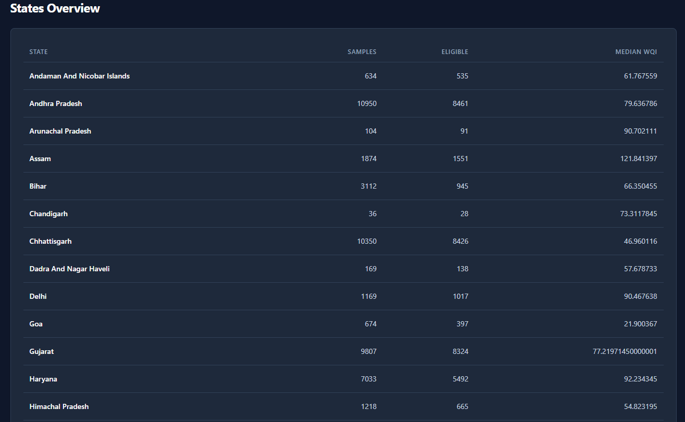

### 8. Station-Level Analysis

Provides historical station statistics, WAWQI eligibility, category distribution, dominant parameter information, and parameter-level statistical profiles.

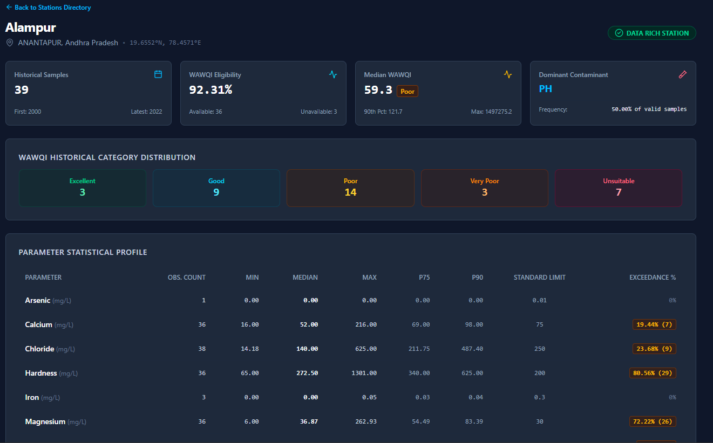

### 9. Station Intelligence

Provides searchable station-level analytical intelligence across 22,753 canonical station identities, including WAWQI eligibility, median WAWQI, dominant parameters, and data-quality classification.

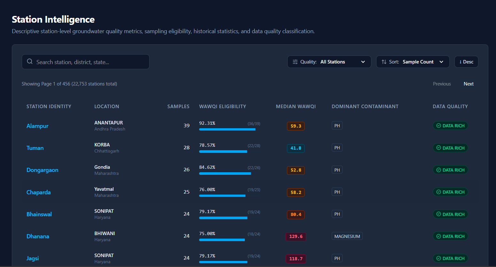

### 10. State Analytics Summary

Compares sample volume, WAWQI availability, median WAWQI, and WAWQI category composition across states and union territories.

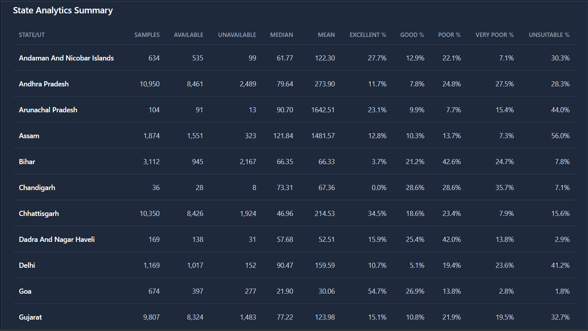

### 11. State Category Composition

Visualizes the distribution of Excellent, Good, Poor, Very Poor, and Unsuitable WAWQI categories across all 30 states/UTs.

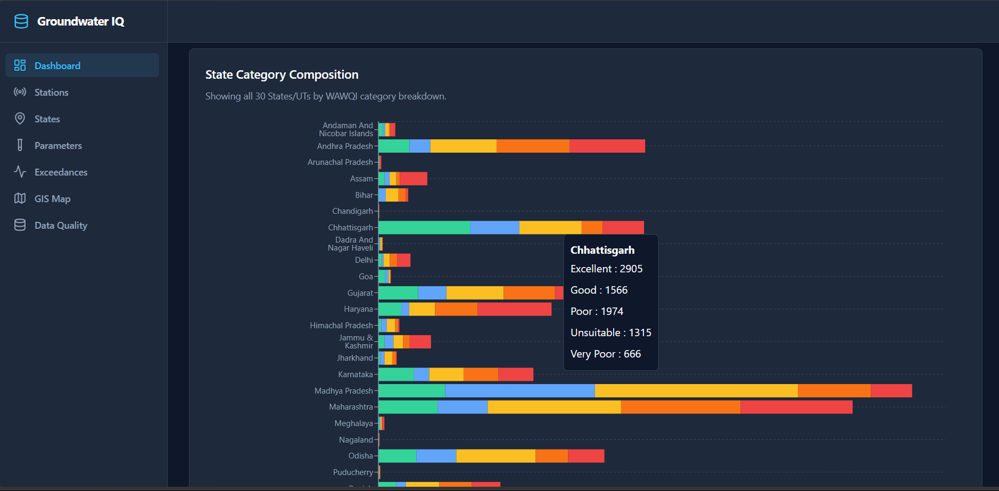

### Screenshot Summary

| View | Analytical Purpose |
|---|---|
| Dashboard Overview | National WAWQI and statistical overview |
| Data Quality | Data completeness and anomaly assessment |
| GIS List View | Spatial record exploration |
| GIS Intelligence | Geographic WAWQI analysis |
| Parameter Exceedances | Standard exceedance analysis |
| Parameter Analytics | Parameter standards and analytical definitions |
| States Overview | State-level comparison |
| Station Detail | Individual station analysis |
| Station Intelligence | Searchable station analytics |
| State Analytics Summary | State-level KPI comparison |
| State Category Composition | WAWQI category distribution by state |

---

## 7. TOOLS & TECHNOLOGIES

| Category | Technology | Usage / Purpose |
| :--- | :--- | :--- |
| **Data & Analytics** | **Python (3.12)**, **Pandas** | Data ingestion, profiling, cleaning, ETL pipeline execution |
| **Database & Modeling** | **PostgreSQL (15+)**, **SQL** | EAV data model, views, materialized views, trigram indexing |
| **Visualization & Reporting** | **React (19)**, **TypeScript**, **Recharts** | Interactive dashboarding, binned distribution charts, percentile reporting |
| **GIS & Spatial Intelligence**| **React-Leaflet**, **Leaflet**, **CARTO** | Geospatial mapping, canvas rendering, category markers, district filtering |
| **Backend & Data Delivery** | **Node.js**, **Express.js**, **Axios** | REST API endpoints, pagination, query optimization, CORS handling |
| **Deployment & DevOps** | **Git**, **Vite**, **Vercel**, **Render**, **Supabase** | Build bundling, SPA rewrite rules, production cloud deployment targets |

---

## 8. RELEVANT SKILLS DEMONSTRATED

```text
┌─────────────────────────────────────────────────────────────────────────────┐
│  Python • Pandas • SQL • PostgreSQL • ETL Pipelines • Data Profiling        │
│  Statistical Analysis • Data Quality & Provenance • Percentile Modeling      │
│  Geographic Analytics • KPI Design • REST API Design • React Dashboarding  │
└─────────────────────────────────────────────────────────────────────────────┘
```

---

## 9. DATA MODEL & SCHEMA DESIGN

The relational data model consists of 6 persistent core tables and analytical materialized views:

```text
source_datasets ──< water_samples ──< sample_parameter_values >── parameters
                         │
                         ├──< wawqi_results
                         │
                         └──> locations (Canonical Geographic Entities)
```

- `source_datasets`: Tracks source CSV file metadata, ingest dates, and raw record counts.
- `locations`: Unique geographic entities (`location_id`, `state`, `district`, `latitude`, `longitude`).
- `parameters`: Catalog of 27 standardized chemical parameters, units, and BIS limits.
- `water_samples`: Physical sampling events (`sample_id`, `station_name`, `sample_date`).
- `sample_parameter_values`: EAV long-format chemical measurements (`1,609,277` rows).
- `wawqi_results`: Calculated WAWQI values, quality categories, and dominant parameter assignments.
- `mv_station_identity`: Materialized view aggregating 22,753 canonical station profiles and data-richness tiers.

---

## 10. QUALITY & VALIDATION

The platform underwent rigorous end-to-end data validation:
- **0 Variance Data Reconciliation:** 100% reconciliation across raw CSV rows, PostgreSQL tables, REST API responses, and frontend UI components.
- **WAWQI Formula Verification:** Independently verified extreme and normal sample computations against mathematical definition.
- **Trigram Search Verification:** PostgreSQL `pg_trgm` extension verified for high-performance station text searching across 22,753 canonical stations.
- **Build & Regression Audit:** Frontend builds cleanly via `tsc && vite build` (0 TypeScript errors, 0 Vite errors).

---

## 11. LIMITATIONS & RESPONSIBLE INTERPRETATION

- **Decision Support Scope:** The platform is designed for analytical decision support and research exploration; it does not replace official regulatory compliance certifications.
- **Source Data Heterogeneity:** Parameter availability varies across state datasets based on original CGWB sampling scope.
- **Extreme Value Interpretation:** Large WAWQI scores are mathematical outcomes of recorded concentrations relative to strict standards; raw values are retained for data lineage and require source-level verification.
- **GIS Canvas Pagination:** Interactive map rendering is paginated at 500 points per page to maintain 60 FPS browser performance across 165,010 location records.

---

## 12. PROJECT ARCHITECTURE & DEPLOYMENT TARGETS

```text
Raw CGWB CSV Files (30 Datasets)
       │
       ▼
Python ETL Pipeline
       │
       ▼
Supabase PostgreSQL (Database Cloud)
       │
       ▼
Render Web Service (Node.js Express API)
       │
       ▼
Vercel Production (React Frontend SPA)
```

---

## 13. QUICK START & LOCAL SETUP

### Prerequisites
- **Node.js:** v18+ (Recommended v22)
- **PostgreSQL:** v15+ (Running on `localhost:5432`)
- **Python:** v3.10+ (For ETL scripts)

### 1. Database Setup
```bash
createdb -U postgres groundwater_quality
psql -U postgres -d groundwater_quality -f sql/01_schema.sql
psql -U postgres -d groundwater_quality -f sql/02_views.sql
psql -U postgres -d groundwater_quality -f sql/03_materialized_views.sql
psql -U postgres -d groundwater_quality -f sql/04_station_intelligence.sql
```

### 2. Backend API Setup
```bash
cd backend
npm install
npm start
# Express REST API running at http://localhost:3000
```

### 3. Frontend Dashboard Setup
```bash
cd frontend
npm install
npm run dev
# Dashboard accessible at http://localhost:5173
```

---

## 14. DOCUMENTATION INDEX

All comprehensive technical and analytical documentation is located in the [`docs/`](file:///d:/PwC/Groundwater%20Quality%20Intelligence%20System/docs/) directory:
- [`DEPLOYMENT_GUIDE.md`](file:///d:/PwC/Groundwater%20Quality%20Intelligence%20System/docs/DEPLOYMENT_GUIDE.md) — Production deployment instructions for Vercel, Render, and Supabase.
- [`DEPLOYMENT_AUDIT.md`](file:///d:/PwC/Groundwater%20Quality%20Intelligence%20System/docs/DEPLOYMENT_AUDIT.md) — Architecture, security, CORS, and engine audit.
- [`SUPABASE_MIGRATION.md`](file:///d:/PwC/Groundwater%20Quality%20Intelligence%20System/docs/SUPABASE_MIGRATION.md) — Database dump, restore, and SQL reconciliation queries.
- [`SETUP_GUIDE.md`](file:///d:/PwC/Groundwater%20Quality%20Intelligence%20System/docs/SETUP_GUIDE.md) — Local developer installation instructions.
- [`ARCHITECTURE.md`](file:///d:/PwC/Groundwater%20Quality%20Intelligence%20System/docs/ARCHITECTURE.md) — Detailed system architecture and database design.
- [`DATA_DICTIONARY.md`](file:///d:/PwC/Groundwater%20Quality%20Intelligence%20System/docs/DATA_DICTIONARY.md) — PostgreSQL schema reference.
- [`WAWQI_METHODOLOGY.md`](file:///d:/PwC/Groundwater%20Quality%20Intelligence%20System/docs/WAWQI_METHODOLOGY.md) — Scientific WAWQI formula and BIS standards.

---

## 15. LICENSE

All original source datasets remain subject to Central Ground Water Board (CGWB) open-data terms.
